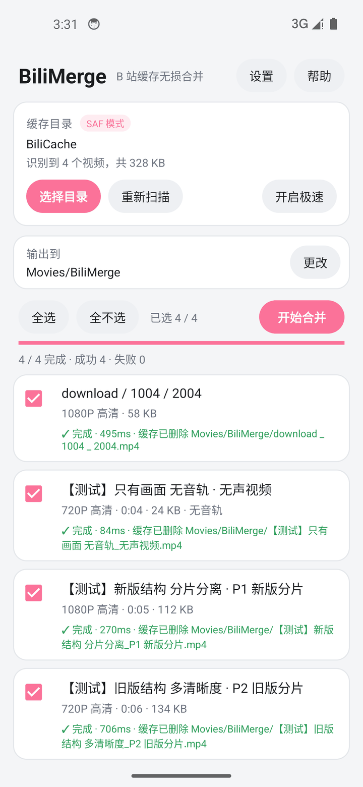

# BiliMerge · B 站缓存无损合并器

一个用 Kotlin 写的轻量 Android 工具：把 B 站客户端缓存的 `m4s` 音视频分片，
用 ffmpeg **无损**（`-c copy`，不重新编码）合并成一个标准 MP4。

> 设计取向：**性能与体积优先**。单 ABI、零网络权限、无 Compose、无 Room、
> 无 DataStore，APK 只有 ffmpeg 那一份必要开销。

## 直接下载

不想自己编译的话，到 [**Releases**](https://github.com/Lin1848624/bilimerge/releases)
下载最新的 `BiliMerge-x.y.z-release.apk` 直接安装即可。

- 环境要求：Android 7.0 (API 24) 及以上，**arm64-v8a**
- 同页还有 `BiliMerge-TestCache.zip`，一份模拟缓存数据集，
  不用真的缓存就能验证应用的四种识别路径



---

## 一、它解决什么问题

B 站客户端把每个视频缓存成两路分离的 fMP4 分片（一路画面、一路声音），
外加一个 `entry.json` 记录标题、清晰度、时长。这些分片本身没法直接播放，
必须重新封装进同一个 MP4 容器才能用。

在 Android 11 及以上，`/Android/data/tv.danmaku.bili/` 对任何普通应用都是不可读的，
所以本应用不试图"偷偷绕过"，而是让用户把缓存目录放到可访问的位置后自选目录处理。

---

## 二、功能

| 能力 | 说明 |
|---|---|
| 自选缓存目录 | SAF 目录选择器，权限持久化，重启后自动恢复 |
| 自动识别 | 不依赖固定目录结构，`entry.json` 为锚点 + 目录结构启发式兜底 |
| 流类型判定 | 先按文件名规则，判不出时读 `moov.hdlr` 判定 `vide`/`soun`，准确率不受命名变化影响 |
| 多清晰度 | 同一分P缓存了多个清晰度时按 `entry.json` 记录优先，其次取体积最大 |
| 批量合并 | 并发队列，默认并发数 = CPU 核心数（2~4），可随时取消 |
| 零拷贝 | 输入输出都走 ffmpeg-kit 的 `saf:` 协议（进程内 fd），不产生任何临时文件 |
| 直达相册 | 默认输出 `Movies/BiliMerge/`，Android 10+ 无需任何存储权限 |
| 可选清理源 | 合并成功后删除本次用到的 m4s，释放空间。精确到文件——元信息与未使用的清晰度原样保留 |
| 极速模式 | 可选授予「所有文件访问权限」，扫描改走 `java.io` 直读，快一个数量级 |
| 深色模式 | 跟随系统 |

---

## 三、构建

环境要求：JDK 17+、Android SDK（platform 35、build-tools 35+）。本机已配好：

```powershell
$env:JAVA_HOME        = "D:\App\jdk-17"
$env:GRADLE_USER_HOME = "D:\App\gradle-home"     # 缓存放 D 盘，不写 C 盘
$env:ANDROID_HOME     = "D:\App\Android-SDK"

# 方式一：用仓库自带的 wrapper（首次会下载 Gradle 8.11.1）
.\gradlew.bat :app:assembleDebug

# 方式二：用本机已解压好的 Gradle
D:\App\gradle-8.11.1\bin\gradle.bat -p . :app:assembleDebug

# Release 包（R8 混淆 + 资源裁剪，用仓库内自签名证书）
D:\App\gradle-8.11.1\bin\gradle.bat -p . :app:assembleRelease

# 单元测试
D:\App\gradle-8.11.1\bin\gradle.bat -p . :app:testDebugUnitTest
```

产物：
- `app/build/outputs/apk/debug/app-debug.apk`（约 20.3 MB）
- `app/build/outputs/apk/release/app-release.apk`（约 17.7 MB，其中 native 库占 16.8 MB）

> `local.properties` 里的 `sdk.dir` 与 `app/bilimerge.jks` 是自用配置，
> 换机器时按需修改。

---

## 三·五、自动化测试

`app/src/test/` 下有两个测试类，共 6 个用例，全部在主机 JVM 上运行，无需设备：

| 测试 | 覆盖内容 |
|---|---|
| `BiliScannerTest` | 新版/旧版目录结构、多清晰度优先级、纯音频、空目录、手写 box 嗅探 |
| `RealDatasetScanTest` | 解压 `testcache.zip`，用**真实的分片式 fMP4** 跑完整识别流程 |

`testcache.zip` 里的样本由 ffmpeg 以 `-movflags frag_keyframe+empty_moov`
生成，box 结构与 B 站 m4s 一致，覆盖四种场景：

```
download/1001/2001/80/{video.m4s, audio.m4s}     新版结构
download/1002/2002/lua.flv.bili2api.{80,64}/...  旧版结构 + 两个清晰度
download/1003/2003/64/video.m4s                  只有画面
download/1004/2004/80/{stream_a,stream_b}.m4s    无 entry.json，靠嗅探
```

这份数据同时打包成了 `BiliMerge-TestCache.zip`，可以推到手机上做实机验证。

---

## 三·六、端到端验证记录

在 Android 14（API 34，x86_64）模拟器上完整跑通了一遍真实用户流程，据此确认了
从 SAF 授权到成品可解码的全链路：

| 步骤 | 结果 |
|---|---|
| 经 SAF 选择 `/sdcard/BiliCache` 并授权 | 通过，徽章显示「SAF 模式」 |
| 自动扫描测试数据集 | 识别 4 个条目、共 328 KB，四种结构全部命中 |
| 全选并批量合并 | **4 / 4 完成 · 成功 4 · 失败 0** |
| MediaStore 输出到 `Movies/BiliMerge/` | 4 个 mp4 全部落盘，中文文件名正确 |
| PC 端 `ffprobe` 复核 | 流结构、分辨率、时长全部正确 |
| `ffmpeg -f null -` 全量解码 | 四个文件均**零错误输出** |

单条合并耗时 184ms / 257ms / 637ms / 687ms，符合 `-c copy` 的应有水平。

三个最容易出错的识别点也一并验证了：

- 无 `entry.json` 的目录被兜底识别，并靠 `moov.hdlr` 正确分出音视频两路
- 纯画面缓存被标为「无音轨」，产物确实只有一路视频流
- 同目录存在两个清晰度时，选中 `entry.json` 记录的 64（720P），
  而不是体积更大的 80（1080P）

> 该轮验证在模拟器上完成。**真机测试仍待执行**——模拟器与真机的差异主要在
> `ContentResolver` 的 provider 实现上，这也正是下面三级降级策略要覆盖的部分。

### 源分片清理的验证（v1.1.0）

打开「设置 → 合并成功后删除源缓存分片」后重跑同一套流程：

| 检查项 | 结果 |
|---|---|
| SAF 目录的删除权限 | 足够，四条均显示「✓ 完成 · 源已清理」 |
| 源文件数量 | 15 → 8，本次用到的 7 个 m4s 被删除 |
| 未使用的清晰度 | `lua.flv.bili2api.80/{0,1}.m4s` **原样保留**（合并用的是 64 那组） |
| 元信息 | 所有 `entry.json` / `index.json` 保留 |
| 目录本身 | 保留（即使已空） |

第三条是关键：它证明清理是**按本次实际用到的文件**进行的，而不是无差别删除整个缓存目录。

---

## 四、代码结构

```
app/src/main/java/com/dsh/bilimerge/
├── App.kt                        Application：初始化 ffmpeg 日志级别、会话历史、全局合并调度器
├── MainActivity.kt               唯一 Activity：目录选择、扫描、列表、进度
├── data/Prefs.kt                 SharedPreferences 封装
├── core/
│   ├── fs/
│   │   ├── DocRef.kt             统一文件引用（SAF uri / 真实路径两种后端）
│   │   └── Storage.kt            Storage 接口 + SafStorage（DocumentsContract 批量查询）
│   │                             + FileStorage（java.io 直读）+ StoreFactory
│   ├── scan/
│   │   ├── Mp4Sniffer.kt         极简 MP4 box 解析，读 moov.hdlr 判定流类型
│   │   ├── EntryMeta.kt          entry.json 多版本兼容解析
│   │   └── BiliScanner.kt        目录遍历与条目识别
│   ├── merge/
│   │   ├── OutputTarget.kt       MediaStore / SAF 目录 / 传统路径三种输出
│   │   ├── MergeEngine.kt        ffmpeg 参数构建与执行、进度、错误提取
│   │   └── MergeManager.kt       并发调度、唤醒锁、节流刷新
│   ├── model/BiliItem.kt         条目数据模型
│   └── util/Fmt.kt               体积/时长格式化、文件名安全化
└── ui/ItemAdapter.kt             列表适配器（逐行 diff，只刷新变化的行）
```

---

## 五、几个关键取舍

**为什么用 `dev.ffmpegkit-maintained` 而不是官方 ffmpeg-kit**
官方 FFmpegKit 已于 2025-01 归档停更，且其 6.0 版本的 `.so` 不满足 16KB 页对齐，
在 Android 15+ 的 16KB 页设备上有加载风险。社区维护分支提供 8.1.9，
原生支持 16KB 页，API 包名仍是 `com.arthenica.ffmpegkit`，迁移零成本。

**为什么选 `-min` 变体**
`-min` 已包含 mov/mp4 解复用器、mp4 复用器以及 `h264_mp4toannexb`、
`aac_adtstoasc` 位流过滤器，覆盖本工具全部需求；`-full` 会带来数倍体积而无收益。

**为什么默认不开 `+faststart`**
它需要把整个 `mdat` 再搬到文件头之后，对本地播放毫无意义，纯粹多花一遍 IO。
需要边下边播时可在「设置」里打开。

**为什么不用 `DocumentFile`**
`androidx.documentfile` 每读一个属性就发一次 IPC。缓存目录动辄上千个文件，
逐项查询会让扫描慢到不可用。这里直接用 `DocumentsContract` 批量查询，
一次 IPC 拿到一整层子项。

**为什么用 `saf:` 协议而不是先复制到私有目录**
`FFmpegKitConfig.getSafParameterForRead/Write` 返回 `saf:<id>`，由 ffmpeg-kit 在
native 侧通过 JNI 回调打开 ContentResolver 的 fd。因为 ffmpeg 与本应用在**同一进程**，
fd 可以直接共享，于是合并几 GB 的缓存也不需要任何中间拷贝。

**并发数**
remux 是顺序 IO 密集而非 CPU 密集，并发过高只会让磁头来回寻道。
默认取 CPU 核心数并夹在 2~4 之间。

---

**`saf:` 协议到底能不能 seek**
能，但这一点当初必须确认——mp4 复用器写完数据要回填 `moov`，要求输出可随机访问。
证据链：反编译 `FFmpegKitConfig$SAFProtocolUrl` 只有 getter/setter，**没有任何 seek 方法**；
`libffmpegkit.so` 里也只有 `saf_open` / `saf_close` 两个回调符号，没有 `saf_seek`。
真正的随机访问发生在 libavformat 侧——它拿到 Java 传来的**真实 fd** 后按普通文件处理，
用 `lseek` 定位（`libavformat.so` 中 `lseek` / `lseek64` / `fstat` 符号齐全）。
结论：只要 provider 给出的 fd 可 seek，直写就能成功。

**输出失败时的三级降级**
即便如此，个别 ROM 的 ContentResolver 仍可能给出不可 seek 的 fd，所以 [MergeManager.kt](app/src/main/java/com/dsh/bilimerge/core/merge/MergeManager.kt)
按下面的顺序逐级退让，每一步都只在真正失败后才走：

| 尝试 | 做法 | 代价 |
|---|---|---|
| 1 | 直写（`saf:` 零拷贝）+ 用户设定的 faststart | 无 |
| 2 | 直写，去掉 faststart | 无（省掉一次全量搬运） |
| 3 | 写 app 私有目录 → 流式搬到目标 | 双倍空间 + 一次拷贝 |

目标是真实路径时（Android 9 及以下）不存在 seek 问题，`supportsStaging = false`，
第 3 步会被跳过，不会白跑一轮。设置里也可以直接勾选「始终用兼容模式」。

---

## 六、已知限制

- **Android 11+ 无法直接读取 `/Android/data/`**，这是系统限制，任何无 root 应用都一样。
  请先用文件管理器或 `adb pull` 把缓存目录搬到公共目录（应用内「帮助」有详细步骤）。
- Release 包用仓库内自签名证书，仅供自用安装。
- 只打包了 `arm64-v8a`：ffmpeg-kit-min 本身也只提供 arm64-v8a 与 x86_64 两个 ABI，
  32 位真机无法安装（现代机型基本不受影响）。

---

## 七、构建期踩到的坑（记录备查）

这三条都是本仓库实际编译失败后定位到的，写下来免得重犯：

1. **ViewBinding 的根布局不能带 `android:id="@+id/root"`。**
   绑定类总会生成 `getRoot()`，再给根布局一个 `root` id 就会撞出两个同名访问器。
   根布局不写 id，直接用 `binding.root` 即可。

2. **`Log.getLevel()` 返回的是 `Level` 枚举，不是 `Int`。**
   想按等级过滤日志要写 `log.level.value <= Level.AV_LOG_ERROR.value`，
   直接 `log.level <= Level.AV_LOG_ERROR.value` 会报类型不匹配。

3. **Kotlin 调用处不能写 `foo(x, needWrite: Boolean = false)`。**
   那是声明默认值的语法，调用处只能写 `foo(x, needWrite = false)`。
   这个错误会连带抛出 5 条语法错误，掩盖真正的问题。

另外，`FFmpegKitConfig` **不需要**任何 `init(context)` 调用，
`getSafParameter*` 系列返回的确实是 `saf:<id>` 形式的字符串（已用 `javap -c` 核对字节码确认）。

---

## 八、许可

本项目以 **GNU General Public License v3.0** 发布，全文见 [LICENSE](LICENSE)。

```
BiliMerge — 把 B 站缓存的无损合并成 MP4
Copyright (C) 2026  Lin1848624

This program is free software: you can redistribute it and/or modify
it under the terms of the GNU General Public License as published by
the Free Software Foundation, either version 3 of the License, or
(at your option) any later version.

This program is distributed in the hope that it will be useful,
but WITHOUT ANY WARRANTY; without even the implied warranty of
MERCHANTABILITY or FITNESS FOR A PARTICULAR PURPOSE.  See the
GNU General Public License for more details.
```

**为什么是 GPL-3.0**：本项目的核心能力来自 FFmpeg 生态。构建时依赖的
`dev.ffmpegkit-maintained:ffmpeg-kit-min` 以 LGPL-3.0 授权，其内嵌的 FFmpeg 核心亦为
LGPL-2.1+。本仓库**不包含**任何 FFmpeg 源码或编译产物，只在构建期以 Maven 依赖引用，
运行时经 JNI 调用随 APK 分发的 `.so`。以 GPL-3.0 发布本应用与上述组件完全兼容，
也回避了"应用层闭源 + 动态链接 LGPL 库"在认定上的争议。

Release 中附带的 APK 同样受 GPL-3.0 约束；再分发时请保留本许可证并注明源码出处。

---

## 九、致谢

- [FFmpeg](https://ffmpeg.org/) —— 所有实际的解复用、复用与位流处理都由它完成
- [ffmpeg-kit-maintained](https://github.com/ffmpegkit-maintained/ffmpeg) —— 官方 FFmpegKit
  停更后的社区维护分支，提供了 Android 15 / 16KB 页对齐支持与 SAF 协议能力
